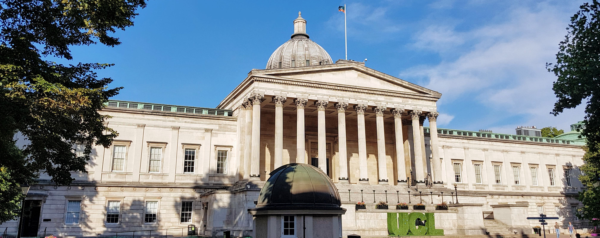

# PhD candidate in Astrophysics

I am a PhD candidate in Extragalactic Astrophysics at UCL. I am studying galaxy evolution using some of the largest optical spectroscopic surveys. I am a member of the [DESI](https://www.desi.lbl.gov/) collaboration. At UCL I am working with [Prof. Amelie Saintonge](http://www.star.ucl.ac.uk/~amelie/) and my interests are in galaxy physics and evolution. I also have an interest in machine learning techniques, particularly likelihood-free inference methods.

I used to work at the Jodrell Bank Observatory as part of their Science Engagement team in the Discovery Centre. I studied for my MSc at The University of Manchester and did my bachelors degree at Universiteit Utrecht in the Netherlands. I am originally from a small town in Noord-Brabant in the Netherlands and have lived in the UK for ~5 years.

  
    <article class="post">

      <h1><a href="{{ site.baseurl }}{{ post.url }}">{{ post.title }}</a></h1>

      

        {{ post.excerpt }}
      

      <a href="{{ site.baseurl }}{{ post.url }}" class="read-more">Read More</a>
    </article>
  

