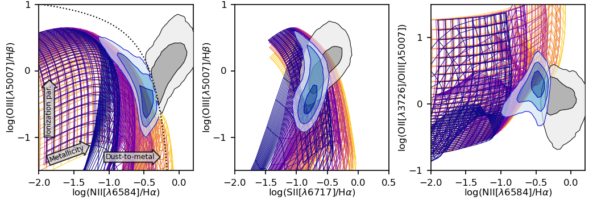

# Dirk Scholte

I am a PhD candidate in Extragalactic Astrophysics at UCL. I am studying galaxy evolution through some of the largest optical spectroscopic surveys.

I am deriving gas mass estimates from spectroscopy using photoionization modelling and machine learning. Using weak lensing to derive dark matter halo masses.

You can find my cv here: <a href="https://dirkscholte.github.io/cv_04-05-2022.pdf" target="_blank">PDF.</a>

## Current projects

<iframe width="560" height="315" src="https://www.youtube.com/embed/7yQjiKuqtYw" title="YouTube video player" frameborder="0" allow="accelerometer; autoplay; clipboard-write; encrypted-media; gyroscope; picture-in-picture" allowfullscreen></iframe>

### Photoionization modelling of HII regions
We produced photoionization models using Cloudy to simulate the emission line fluxes for HII regions with a range of physical conditions. The photoionization models are used to train a neural network for approximate posterior inference using Simulation Based Inference (Tejero-Cantero et al. 2020). We use these models to derive the physical characteristics of observed galaxies using the measured emission line fluxes in their spectra.

### The mass-metallicity relation for star forming galaxies with DESI
We are using DESI BGS (and in the first instance the Science Validation data) to analyse the mass-metallicity relation of galaxies out to z=0.4. The metallicities will be measured using strong emission line calibrations, as well as via CLOUDY photoionization modelling; this modelling also provides us with an estimate of the gas mass. Combining these measurements with the stellar masses and star formation rates from PROVABGS-SV, we will derive the mass-metallicity relation for BGS galaxies, with the following main objectives: (1) capitalising on the extra depth of SV to assess how well metallicities will be recovered in the full survey using our two different methods, (2) determining the shape and scatter of the M-Z relation, and (3) test whether SFR or gas mass is the most fundamental parameter in driving the scatter of the M-Z relation.

### The role of gas in the stellar-halo connection
We are deriving the baryon-halo mass relation (expansion of the SHMR) for star forming galaxies using the DESI BGS sample. We will study the role of the total baryon mass in the scatter of the SHMR. The total baryon mass is calculated through the sum of stellar mass and gas mass of galaxies. The total gas mass is estimated directly from the spectra through fitting of the emission lines to models using Cloudy photoionization. We derive halo masses using galaxy-galaxy lensing measurements. We will make use of existing shape catalogs from KiDS, SDSS, and DES.

### ORBYTS Galaxies: Discovering the relation between star formation and molecular gas in galaxies
This is a project we are developing to be taught in schools, giving students an opportunity to do astronomy research. We will study high-resolution MUSE and ALMA observations of nearby galaxies in the PHANGS survey (Emsellem et al. 2021, Leroy et al. 2021). 

<iframe frameborder="0" class="juxtapose" width="100%" height="805" src="https://cdn.knightlab.com/libs/juxtapose/latest/embed/index.html?uid=c3ece34a-7581-11ec-abb7-b9a7ff2ee17c"></iframe>

## Previous projects

### Pulsar flux density variability in LOFAR observations
Using simultaneous beam formed and imaging observations from the LOw-Frequency ARray (LOFAR) between May and October 2016 we have quantified the variability in flux densities of PSRs B1508+55, B1919+21, B2016+28 and B2020+28. The observed flux density variability can be attributed to a combination of ionospheric disturbances, processes intrinsic to the pulsars and refractive interstellar scintillation. Ionospheric effects severely affected beam formed measurements during 3 out of 28 observations. Significant fractions of the pulsar flux densities went undetected due to shifts in the apparent positions of the pulsars relative to the synthesized beam pointing. Both intrinsic variability and refractive interstellar scintillation was measured using the modulation index and weighted 
\$$ \chi^2_{\text{red}} $$ variability strength measurements. Interferometric observations facilitated the monitoring of hundreds of sources in the fields of the observations, allowing comparison and quantification of the significance of the measured pulsar flux density variability. This work shows the potential of simultaneous beam formed and imaging observations in the identification of flux density variability. The simultaneous observations provide necessary additional parameters to aid in the identification of the cause of flux density variability at low radio frequencies, where a multitude of different causes affect pulsar flux density. Other current and future low-frequency facilities such as  MWA, GMRT, LWA and SKA-LFAA are likely to also be sensitive to the same sources of flux density variability as found in these LOFAR observations.

This work was done as part of my MSc by Research at the Jodrell Bank Centre for Astrophysics at the University of Manchester.
