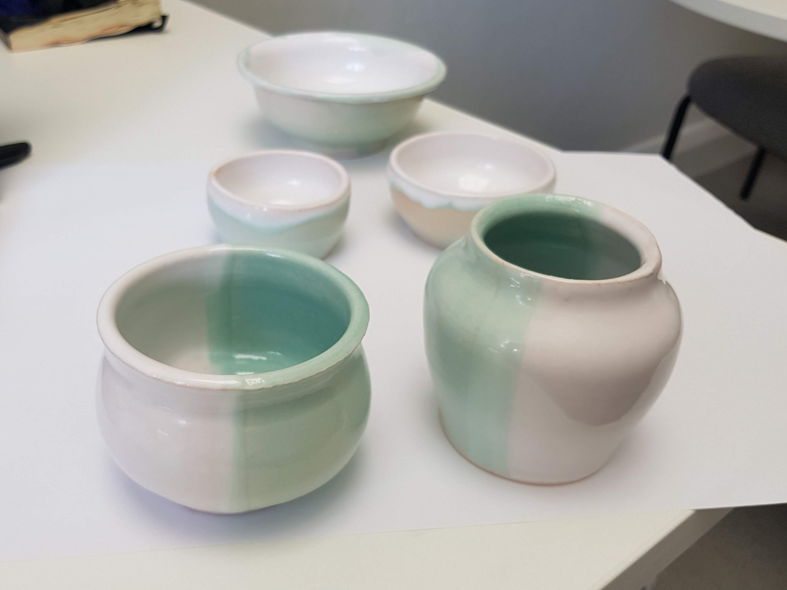
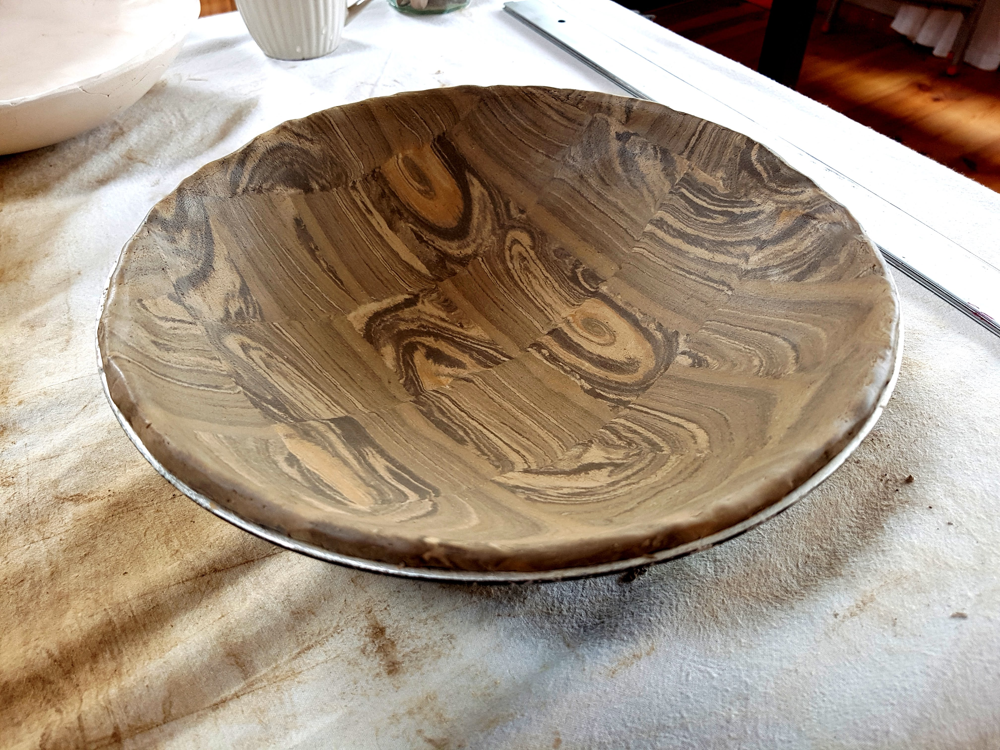
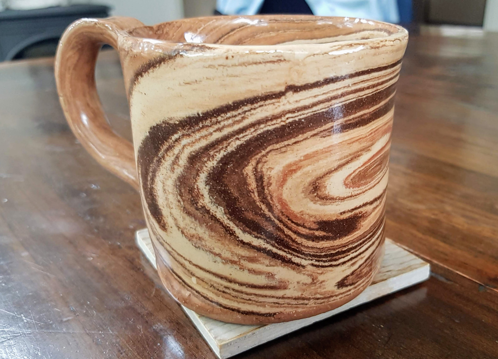
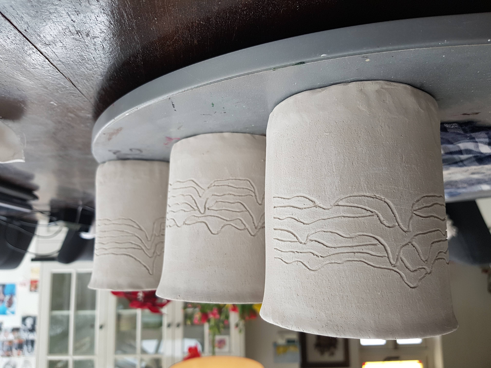
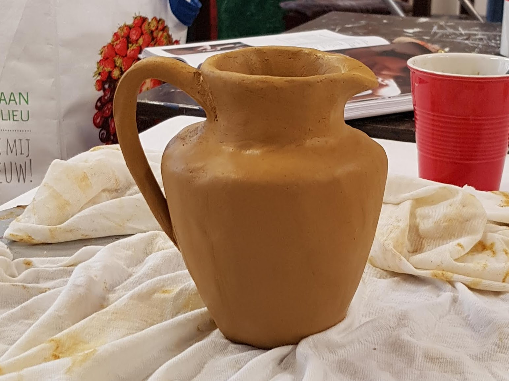
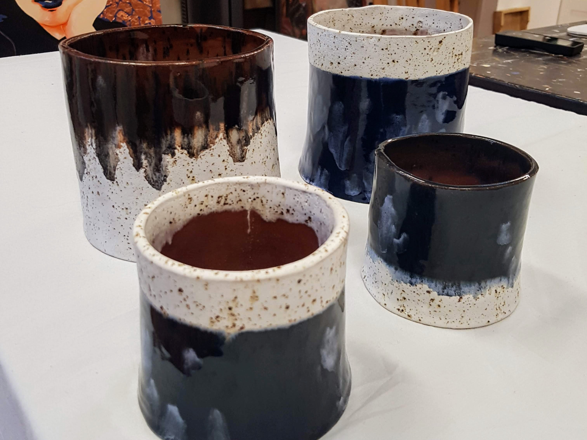

# Pottery

Photos of some of my pots and other ceramics. These are both finished pots and work in progress pics! 

Some pots thrown on the wheel and dip glazed. Two small vases, a breakfast bowl and two small bowls.

A bowl made using marbled clay. Pre-firing

A mug made using marbled clay with clear glaze.

Mugs decorated with pulse profiles of well known pulsars. Bisque fired.

Pinch pot water jug.

Some pots made by my sister and glazed together in crystal glazes.
